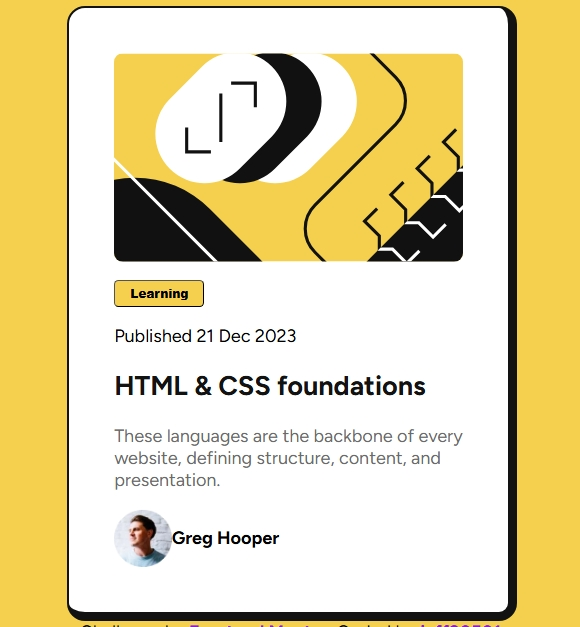

## Table of contents

- [Overview](#overview)
  - [The challenge](#the-challenge)
  - [Links](#links)
- [My process](#my-process)
  - [Built with](#built-with)
  - [What I learned](#what-i-learned)
  - [Continued development](#continued-development)
  - [Useful resources](#useful-resources)
- [Author](#author)
- [Acknowledgments](#acknowledgments)

## screenshot


## Overview
This project is a blog preview card, inspired by a Frontend Mentor challenge. It showcases a blog post preview, including an illustration image, a "Learning" tag button, publication date, title, description, and author avatar. The card is designed to look modern, clean, and eye-catching — with strong focus on visual hierarchy and layout.


## My process

### Built with
HTML5 — semantic and accessible markup

CSS3 — custom classes, hover effects, Google Fonts integration, flexbox

JavaScript — small inline alert functionality for the button
- [Styled Components](https://fonts.googleapis.com/css2?family=Figtree:ital,wght@0,300..900;1,300..900&display=swap) - For styles


### What I learned

improved my skills in flexbox layout.

Practiced integrating Google Fonts for custom typography.

Learned how to style and structure interactive buttons with hover states.

Reinforced knowledge on linking external pages securely and semantically.
To see how you can add code snippets, see below:

```html
<h1>Some HTML code I'm proud of</h1>
```
```css
.proud-of-this-css {
  color: papayawhip;
}
```
```js
const proudOfThisFunc = () => {
  console.log('🎉')
}
```

If you want more help with writing markdown, we'd recommend checking out [The Markdown Guide](https://www.markdownguide.org/) to learn more.


## Author
- Frontend Mentor - [@jeff20501](https://www.frontendmentor.io/profile/jeff20501)
- github - [@jeff20501](https://github.com/jeff20501)


## Acknowledgments

